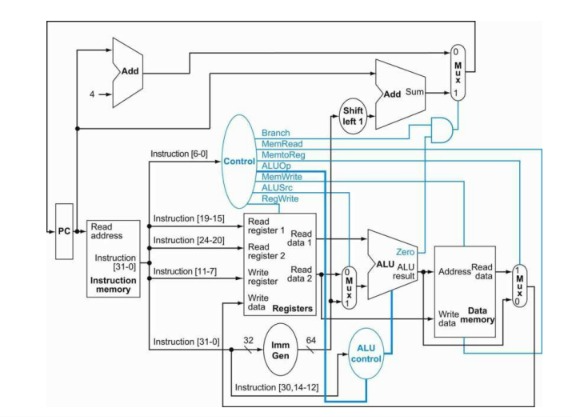
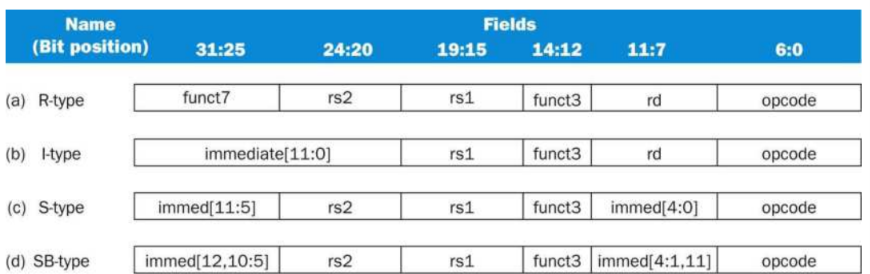

# RISC-V Single-Cycle Processor

Verilog implementation of a single-cycle RISC-V processor. The datapath and control logic follow the design from *Computer Organization and Design: The Hardware/Software Interface* by David A. Patterson and John L. Hennessy.

---

## Datapath Overview

The core executes instructions in a single clock cycle across five steps:
* **Fetch:** Reads instruction from memory and increments `PC + 4`.
* **Decode:** Generates control signals, reads source registers (`rs1`, `rs2`), and extends immediates.
* **Execute:** ALU computes the result or branch condition.
* **Memory:** Accesses data memory for load and store operations.
* **Write-Back:** Writes the final result back to `rd`.

---

## Supported Formats

* **R-type:** Register-register operations (`add`, `sub`, `and`, `or`)
* **I-type:** Immediate arithmetic and loads (`addi`, `lw`)
* **S-type:** Memory stores (`sw`)
* **SB-type:** Conditional branches (`beq`)

---

## ALU Operations

| ALU Lines | Operation |
|:---:|:---:|
| `0000` | AND |
| `0001` | OR |
| `0010` | ADD |
| `0110` | SUB |
