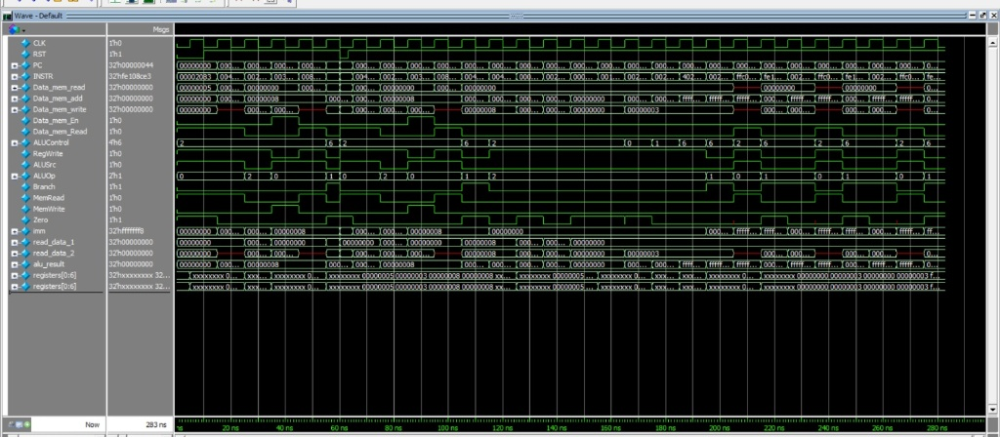

# RISC-V Single-Cycle Processor

Verilog implementation of a single-cycle RISC-V processor. The datapath and control logic follow the design from *Computer Organization and Design: The Hardware/Software Interface* by David A. Patterson and John L. Hennessy.

---

## Datapath Overview


The core executes instructions in a single clock cycle across five steps:
* **Fetch:** Reads instruction from memory and increments `PC + 4`.
* **Decode:** Generates control signals, reads source registers (`rs1`, `rs2`), and extends immediates.
* **Execute:** ALU computes the result or branch condition.
* **Memory:** Accesses data memory for load and store operations.
* **Write-Back:** Writes the final result back to `rd`.

---

## Supported Formats


* **R-type:** Register-register operations (`add`, `sub`, `and`, `or`)
* **I-type:** Immediate arithmetic and loads (`addi`, `lw`)
* **S-type:** Memory stores (`sw`)
* **SB-type:** Conditional branches (`beq`)

---

## ALU Operations

| ALU Lines | Operation |
|:---:|:---:|
| `0000` | AND |
| `0001` | OR |
| `0010` | ADD |
| `0110` | SUB |

## Simulation & Verification

The core was verified in QuestaSim/ModelSim using a test program designed to validate basic operations as well as corner cases (zero-register immutability, data hazards, zero offsets, negative branch offsets, and signed immediate handling).

```hex
00002083  # lw   x1, 0(x0)        - Load from base address 0
00402103  # lw   x2, 4(x0)        - Load from address 4
002081B3  # add  x3, x1, x2       - Register addition (x3 = x1 + x2)
00302423  # sw   x3, 8(x0)        - Store sum into memory address 8
00802203  # lw   x4, 8(x0)        - Load stored value to verify write
00418463  # beq  x3, x4, label1   - Forward branch (taken: x3 == x4)
002082B3  # add  x5, x1, x2       - Skipped instruction if branch works
00418333  # add  x6, x3, x4       - Branch target
00000033  # add  x0, x0, x0       - NOP / verify x0 hardwired to 0
00208033  # add  x0, x1, x2       - Verify writes to x0 are discarded
000000B3  # add  x1, x0, x0       - Reset x1 using zero register
001080B3  # add  x1, x1, x1       - Self-accumulate test
0020F1B3  # and  x3, x1, x2       - Bitwise AND operation
0020E233  # or   x4, x1, x2       - Bitwise OR operation
402082B3  # sub  x5, x1, x2       - Register subtraction (R-type)
00208463  # beq  x1, x2, label2   - Branch not taken test (x1 != x2)
FFC0A303  # lw   x6, -4(x1)       - Negative offset load (signed immediate)
FE108CE3  # beq  x1, x1, -8       - Backward loop branch (negative offset)
````


